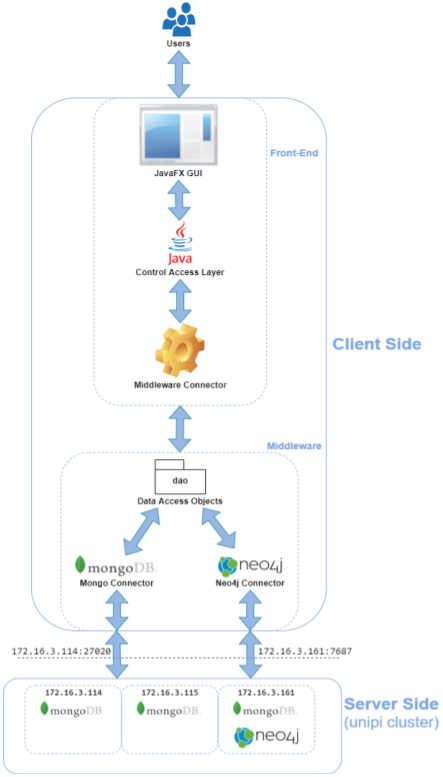
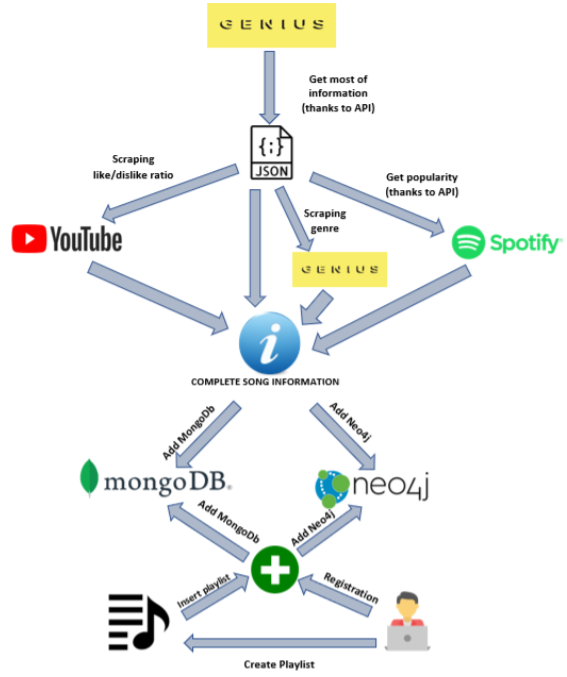

# LSMDB_UniMusic
Project for the <i>'Large-Scale and Multi-Structured Databases'</i> course. Please, check the [Documentation](Documentation.pdf) for a complete view. 

## Introduction
<b>UniMusic</b> is an application whose main purpose is to provide a song search and management service; songs that can be found on the platform are associated with links to official sources on the Internet, where users can listen to them (for example, official YouTube / Spotify source).
The application provides general information about each stored song (e.g. name, genre, artist) and offers users the ability to search and browse them, possibly applying specific
filters to narrow the search scope. Users can then express their thoughts on the songs through a "like" system and possibly add them to favorites.
In order to simplify and improve user experience, it's possible to organize songs into playlists or follow other people's playlists. Users can also follow other users to get suggestions on songs and playlists you might like.

## Software Architecture
The application has been divided into two-tiers according to the Client-Server paradigm, exploiting Java as the core programming language.

### Client Side
The client side is divided into:
- A Front-End module, in charge of
  - providing a GUI based on JavaFX for users to interact with the application.
  - communicating with the underlying middleware to retrieve information obtained by processing data stored on server side.
- A Middleware module, which communicates with the server side. It includes the logic used to communicate with the MongoDB cluster and the Neo4j database on the server, plus all the logic needed to handle and process data retrieved so that it can be used by the front end to present it to users.

### Server Side
Server composed of 3 virtual machines which hosts a MongoDB cluster and a single instance of the
Neo4j database.

## Dataset Organization and Database Population
### Song information
The application dataset is manly composed by songs’ information, that are the core of our application.
Firstly, we have obtained almost all the information using services offered by [GENIUS](https://www.genius.com), that permits to scrape their content through HTTP-based API.
It returns a raw json document for each song requested; we then filter all information needed, in particular also 2 URLs and a URI that are used to scrape remaining information:
- using the Genius URL to the specific song page, we scrape the attribute “genre” that is not provided through API.
- using the Spotify URI, we have requested, through Spotify API, the song’s popularity.
- using the YouTube URL to the official video of the song we scrape the number of Like and Dislike.
The last two information have been used to create our “popularity” attribute as an aggregation of Spotify popularity and YouTube Like/Dislike ratio using this formula:
<i>0.7 * SpotifyPopularity + YouTubeRatio * 0.3.</i>

Here we have a summary of how the two databases are populated:

